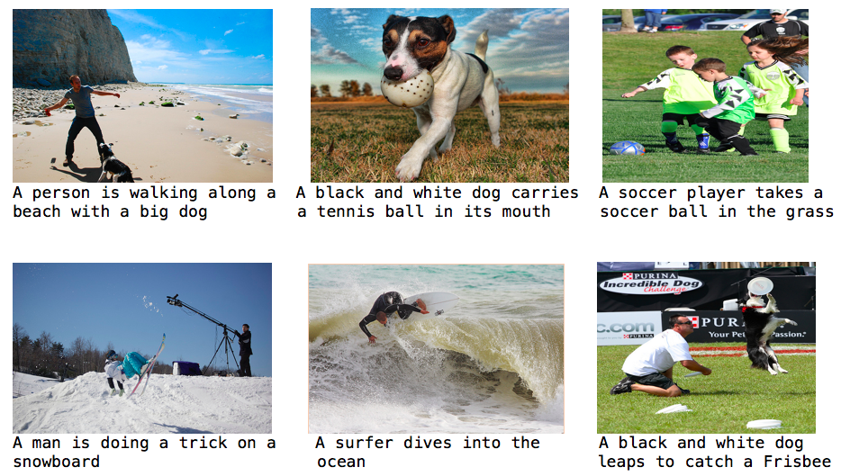

# caption_generator: An image captioning project

__Note__: This project is no longer under active development. However, queries and pull requests will be responded to. Thanks!

To generate a caption for any image in natural language, English. The architecture for the model is inspired from [1] by Vinyals et al. The module is built using [keras](https://keras.io/), the deep learning library. 

This repository serves two purposes:
- present/ discuss my model and results I obtained
- provide a simple architecture for image captioning to the community

## Model 

The Image captioning model has been implemented using the Sequential API of keras. It consists of three components:
1. __An encoder CNN model__: A pre-trained CNN is used to encode an image to its features. In this implementation VGG16 model[d] is used as encoder and with its pretrained weights loaded. The last softmax layer of VGG16 is removed and the vector of dimention (4096,) is obtained from the second last layer. 

	_To speed up my training, I pre-encoded each image to its feature set. This is done in the `prepare_dataset.py` file to form a resultant pickle file `encoded_images.p`. In the current version, the image model takes the (4096,) dimension encoded image vector as input. This can be overrided by uncommenting the VGG model lines in `caption_generator.py`. There is no fine tuning in the current version but can be implemented._

2. __A word embedding model__: Since the number of unique words can be large, a one hot encoding of the words is not a good idea. An embedding model is trained that takes a word and outputs an embedding vector of dimension (1, 128).

	_Pre-trained word embeddings can also be used._

3. __A decoder RNN model__: A LSTM network has been employed for the task of generating captions. It takes the image vector and partial captions at the current timestep and input and generated the next most probable word as output. 

The overall architecture of the model is described by the following picture. It also shows the input and output dimension of each layer in the model. 

    

## Dataset
The model has been trained and tested on Flickr8k dataset[2]. There are many other datasets available that can used as well like:	
- Flickr30k
- MS COCO
- SBU
- Pascal

## Experiments and results
The model has been trained for 50 epochs which lowers down the loss to 2.6465. With a larger dataset, it might be needed to run the model for atleast 50 more epochs. 

With the current training on the Flickr8k dataset, running test on the 1000 test images results in,
				`BLEU = ~0.57`.

Some captions generated are as follows:

    

----------------------------------

## Requirements 
- tensorflow
- keras
- numpy
- h5py
- pandas
- Pillow

These requirements can be easily installed by:
	`pip install -r requirements.txt`

## Scripts 

- __caption_generator.py__: The base script that contains functions for model creation, batch data generator etc.
- __prepare_dataset.py__: Prepares the dataset for training. Changes have to be done to this script if new dataset is to be used. 
- __train_model.py__: Module for training the caption generator.
- __test_model.py__: Contains module for testing the performance of the caption generator, currently it contains the (BLEU)[https://en.wikipedia.org/wiki/BLEU] metric. New metrics can be added. 

## Usage

After the requirements have been installed, the process from training to testing is fairly easy. The commands to run:
1. `python prepare_dataset.py`
2. `python train_model.py`
3. `python test_model.py`

----------------------------------

## References 
[1] Oriol Vinyals, Alexander Toshev, Samy Bengio, Dumitru Erhan. [Show and Tell: A Neural Image Caption Generator](https://arxiv.org/pdf/1411.4555.pdf)

[2]	Cyrus Rashtchian, Peter Young, Micah Hodosh, and Julia Hockenmaier. Collecting Image Annotations Using Amazon's Mechanical Turk. In Proceedings of the NAACL HLT 2010 Workshop on Creating Speech and Language Data with Amazon's Mechanical Turk.

----------------------------------

## Acknowledgements

[a] I am thankful to my project guide Prof. NK Bansode and a big shoutout to my project teammates. We have also developed an implementation of [1] in TensorFlow available at [image-caption-generator](https://github.com/neural-nuts/image-caption-generator) which had been trained and tested on MS COCO dataset.

[b] Special thanks to [Ashwanth Kumar](https://github.com/ashwanthkumar) for helping me with the resources and effort to train my models. 

[c] [Keras: Deep Learning library for Theano and TensorFlow](https://keras.io/): Thanks to [François Chollet](https://github.com/fchollet) for developing and maintaining such a wonderful library.

[d] [deep-learning-models](https://github.com/fchollet/deep-learning-models): Thanks to [François Chollet](https://github.com/fchollet) for providing pretrained VGG16 model and weights. 

